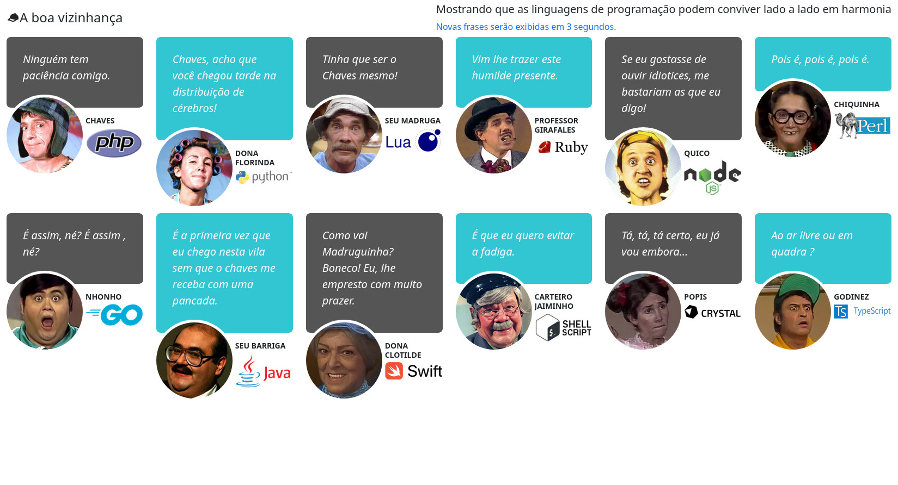

# A Boa Vizinhança

Aplicação totalmente nonsense feita para fazer um simples arquivo html ser provido de um conteúdo de frases aletórias oriundas de API's desenvolvidas em diferentes linguagens de programação. 

Cada personagem do seriado "Chaves" exibe uma frase retornada de uma API diferente. 

Para rodar o projeto basta executar o comando "docker-compose up". Você pode visualizar a página na url "http://localhost:8000/".

## Colaborações e sugestões serão bem-vindas! 

