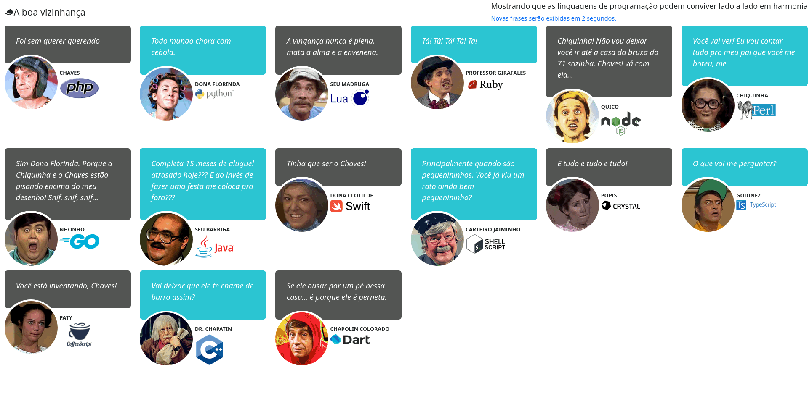
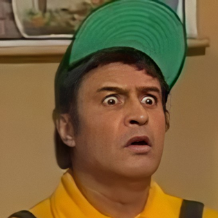
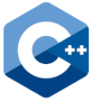

# A Boa Vizinhança



Página web que mostra frases aleatórias dos personagens da série Chaves, onde cada frase é retornada por uma aplicação backend desenvolvida em uma linguagem de programação diferente.

Cada personagem do seriado "Chaves" exibe uma frase retornada de uma aplicação web desenvolvida com uma linguagem distinta. 

## Personagem/Linguagem de Programação/URL

<table>
    <tr>
        <th colspan="2" style="text-align: center;">Personagem</th>
        <th style="text-align: center;">Linguagem de Programação</th>
        <th style="text-align: center;">URL</th>
    </tr>
    <tr>
        <td style="text-align: center;"></td>
        <td style="text-align: center;">Chaves</td>
        <td style="text-align: center;"></td>
        <td style="text-align: center;">http://localhost:8001</td>
    </tr>
    <tr>
        <td style="text-align: center;"></td>
        <td style="text-align: center;">Professor Girafales</td>
        <td style="text-align: center;"></td>
        <td style="text-align: center;">http://localhost:8002</td>
    </tr>
    <tr>
        <td style="text-align: center;"></td>
        <td style="text-align: center;">Quico</td>
        <td style="text-align: center;"></td>
        <td style="text-align: center;">http://localhost:8003</td>
    </tr>
    <tr>
        <td style="text-align: center;"></td>
        <td style="text-align: center;">Dona Florinda</td>
        <td style="text-align: center;"></td>
        <td style="text-align: center;">http://localhost:8004</td>
    </tr>
    <tr>
        <td style="text-align: center;"></td>
        <td style="text-align: center;">Seu Madruga</td>
        <td style="text-align: center;"></td>
        <td style="text-align: center;">http://localhost:8005</td>
    </tr>
    <tr>
        <td style="text-align: center;"></td>
        <td style="text-align: center;">Chiquinha</td>
        <td style="text-align: center;"></td>
        <td style="text-align: center;">http://localhost:8006</td>
    </tr>
    <tr>
        <td style="text-align: center;"></td>
        <td style="text-align: center;">Nhonho</td>
        <td style="text-align: center;"></td>
        <td style="text-align: center;">http://localhost:8007</td>
    </tr>
    <tr>
        <td style="text-align: center;"></td>
        <td style="text-align: center;">Seu Barriga</td>
        <td style="text-align: center;"></td>
        <td style="text-align: center;">http://localhost:8008</td>
    </tr>
    <tr>
        <td style="text-align: center;"></td>
        <td style="text-align: center;">Dona Clotilde</td>
        <td style="text-align: center;"></td>
        <td style="text-align: center;">http://localhost:8009</td>
    </tr>
    <tr>
        <td style="text-align: center;"></td>
        <td style="text-align: center;">Carteiro Jaiminho</td>
        <td style="text-align: center;"></td>
        <td style="text-align: center;">http://localhost:8010</td>
    </tr>
    <tr>
        <td style="text-align: center;"></td>
        <td style="text-align: center;">Popis</td>
        <td style="text-align: center;"></td>
        <td style="text-align: center;">http://localhost:8011</td>
    </tr>
    <tr>
        <td style="text-align: center;"></td>
        <td style="text-align: center;">Godinez</td>
        <td style="text-align: center;"></td>
        <td style="text-align: center;">http://localhost:8012</td>
    </tr>
    <tr>
        <td style="text-align: center;"></td>
        <td style="text-align: center;">Paty</td>
        <td style="text-align: center;"></td>
        <td style="text-align: center;">http://localhost:8013</td>
    </tr>
    <tr>
        <td style="text-align: center;"></td>
        <td style="text-align: center;">Doutor Chapatin</td>
        <td style="text-align: center;"></td>
        <td style="text-align: center;">http://localhost:8014</td>
    </tr>
    <tr>
        <td style="text-align: center;"></td>
        <td style="text-align: center;">Chapolin Colorado</td>
        <td style="text-align: center;"></td>
        <td style="text-align: center;">http://localhost:8015</td>
    </tr>
</table> 
 

## Rodando o Projeto

### Pré-requisitos

- Docker
- Docker Compose

### Instruções

1. Clone o repositório:

```bash
git clone https://github.com/seu-usuario/boa-vizinhanca.git
cd boa-vizinhanca
```

2. Faça o build das imagens:

```bash
docker-compose build
```

3. Inicie os containers:

```bash
docker-compose up
```

4. Acesse a aplicação em: **http://localhost:8000**

### Atenção

O tempo para download das imagens e build dos containers pode variar de 5 a 15 minutos na primeira execução. Em máquinas com processadores mais antigos ou pouca memória RAM, esse tempo pode ultrapassar 20 minutos. 

### Configuração de URL

Caso você queira mudar o endereço de acesso aos backends, edite o arquivo `frontend/config.json` alterando a chave `url`. O valor padrão é `http://localhost`. 

#### URL padrão

```json
{
    "url": "http://localhost"
}
``` 

#### URL alterada

```json
{
    "url": "http://192.168.10.0.1"
}
``` 

**Importante:** Altere apenas o IP/hostname, sem incluir a porta. A página frontend será sempre acessada na porta `8000`.

## Tecnologias

Este projeto demonstra a integração de 15 linguagens de programação diferentes:

- PHP
- Ruby
- Node.js
- Python
- Lua
- Perl
- Go
- Java
- Swift
- Shell Script
- Crystal
- TypeScript
- CoffeeScript
- C++
- Dart

Todas orquestradas com Docker Compose e servidas através de um frontend HTML/CSS/JavaScript.

## Contribuindo

Contribuições são bem-vindas! Sinta-se à vontade para:

- Reportar bugs
- Sugerir novas funcionalidades
- Adicionar novos personagens com outras linguagens
- Melhorar a documentação

## Licença

Veja o arquivo [LICENSE](LICENSE) para mais detalhes. 
