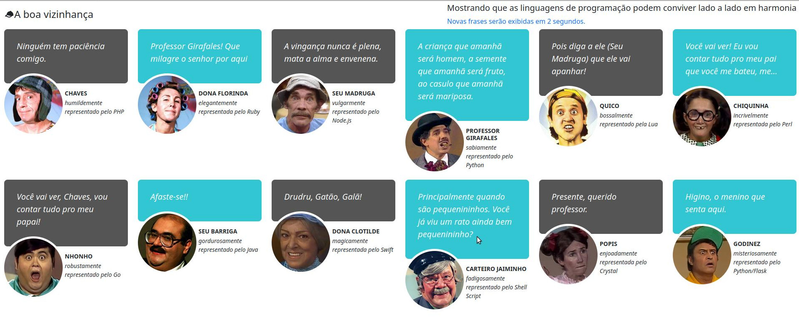

# A Boa Vizinhança

Aplicação totalment No Sense feita apenas para fazer um simples arquivo html ser provido de um conteúdo de frases aletórias oriundas de API's desenvolvidas em diferentes linguagens de programação. 

Cada personagem do seriado "Chaves" exibe uma frase retornada de uma API. 

Para rodar o projeto basta executar o comando "docker-compose up".  

## Colaborações e sugestões serão bem-vindas! 

