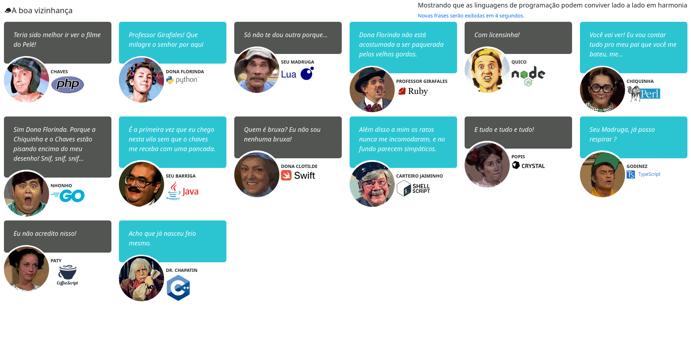

# A Boa Vizinhança

 

Página web totalmente nonsense feita para mostrar frases aletórias dos personagens da série Chaves oriundas de aplicações simples desenvolvidas em diferentes linguagens de programação. 

Cada personagem do seriado "Chaves" exibe uma frase retornada de uma aplicação web desenvolvida com uma linguagem dinstinta. 

## Personagem/Linguagem de Programação/URL

<table>
    <tr>
        <th colspan="2" style="text-align: center;">Personagem</th>
        <th style="text-align: center;">Linguagem de Programação</th>
        <th style="text-align: center;">URL</th>
    </tr>
    <tr>
        <td style="text-align: center;"></td>
        <td style="text-align: center;">Chaves</td>
        <td style="text-align: center;"></td>
        <td style="text-align: center;">http://localhost:8001</td>
    </tr>
    <tr>
        <td style="text-align: center;"></td>
        <td style="text-align: center;">Professor Girafales</td>
        <td style="text-align: center;"></td>
        <td style="text-align: center;">http://localhost:8002</td>
    </tr>
    <tr>
        <td style="text-align: center;"></td>
        <td style="text-align: center;">Quico</td>
        <td style="text-align: center;"></td>
        <td style="text-align: center;">http://localhost:8003</td>
    </tr>
    <tr>
        <td style="text-align: center;"></td>
        <td style="text-align: center;">Dona Florinda</td>
        <td style="text-align: center;"></td>
        <td style="text-align: center;">http://localhost:8004</td>
    </tr>
    <tr>
        <td style="text-align: center;"></td>
        <td style="text-align: center;">Seu Madruga</td>
        <td style="text-align: center;"></td>
        <td style="text-align: center;">http://localhost:8005</td>
    </tr>
    <tr>
        <td style="text-align: center;"></td>
        <td style="text-align: center;">Chiquinha</td>
        <td style="text-align: center;"></td>
        <td style="text-align: center;">http://localhost:8006</td>
    </tr>
    <tr>
        <td style="text-align: center;"></td>
        <td style="text-align: center;">Nhonho</td>
        <td style="text-align: center;"></td>
        <td style="text-align: center;">http://localhost:8007</td>
    </tr>
    <tr>
        <td style="text-align: center;"></td>
        <td style="text-align: center;">Seu Barriga</td>
        <td style="text-align: center;"></td>
        <td style="text-align: center;">http://localhost:8008</td>
    </tr>
    <tr>
        <td style="text-align: center;"></td>
        <td style="text-align: center;">Dona Clotilde</td>
        <td style="text-align: center;"></td>
        <td style="text-align: center;">http://localhost:8009</td>
    </tr>
    <tr>
        <td style="text-align: center;"></td>
        <td style="text-align: center;">Carteiro Jaiminho</td>
        <td style="text-align: center;"></td>
        <td style="text-align: center;">http://localhost:8010</td>
    </tr>
    <tr>
        <td style="text-align: center;"></td>
        <td style="text-align: center;">Popis</td>
        <td style="text-align: center;"></td>
        <td style="text-align: center;">http://localhost:8011</td>
    </tr>
    <tr>
        <td style="text-align: center;"></td>
        <td style="text-align: center;">Godinez</td>
        <td style="text-align: center;"></td>
        <td style="text-align: center;">http://localhost:8012</td>
    </tr>
    <tr>
        <td style="text-align: center;"></td>
        <td style="text-align: center;">Paty</td>
        <td style="text-align: center;"></td>
        <td style="text-align: center;">http://localhost:8013</td>
    </tr>
    <tr>
        <td style="text-align: center;"></td>
        <td style="text-align: center;">Doutor Chapatin</td>
        <td style="text-align: center;"></td>
        <td style="text-align: center;">http://localhost:8014</td>
    </tr>
</table>
 
 

Para rodar o projeto use o comando "docker-compose up". Visualize a página na url "http://localhost:8000/". 

### Atenção! 
O tempo para download das imagens e montagem dos containers pode variar de 5 a 15 minutos. Se o modelo do seu processador for muito defasado e a quantidade de memória RAM for baixa esse tempo pode passar dos 20 minutos. 

Caso você queira mudar o IP, entre no diretório 'frontend' e altere o arquivo 'config.json' mudando a chave 'url'. 
A url padrão é http://localhost. 

#### URL padrão

```json
{
    "url": "http://localhost"
}
``` 

#### URL alterada

```json
{
    "url": "http://192.168.10.0.1"
}
``` 

Altere apenas o IP, sem acrescentar a porta. A página será acessada sempre na porta '8000'

## Colaborações e sugestões serão bem-vindas! 
